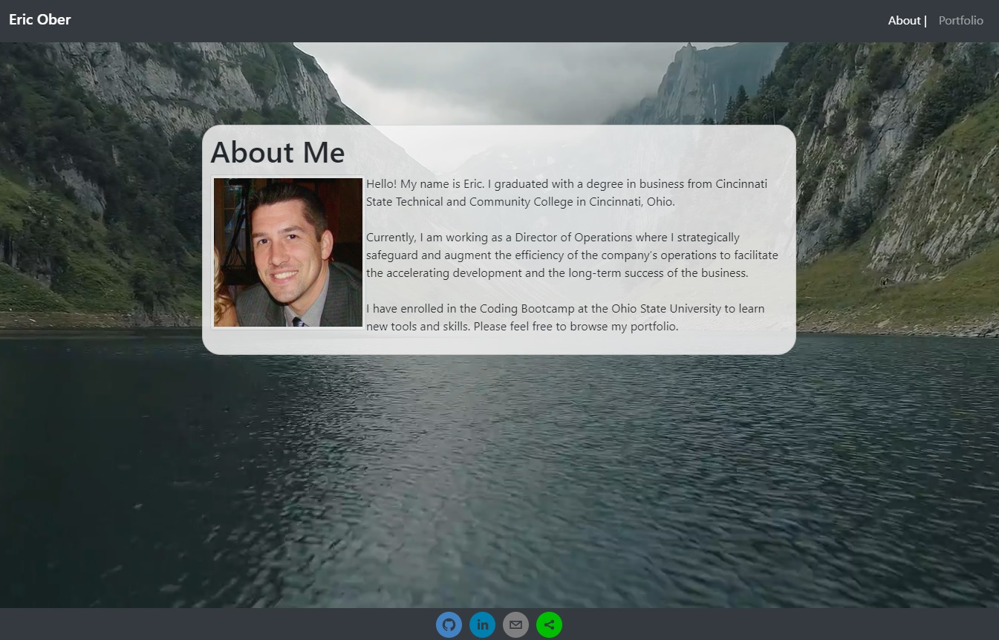
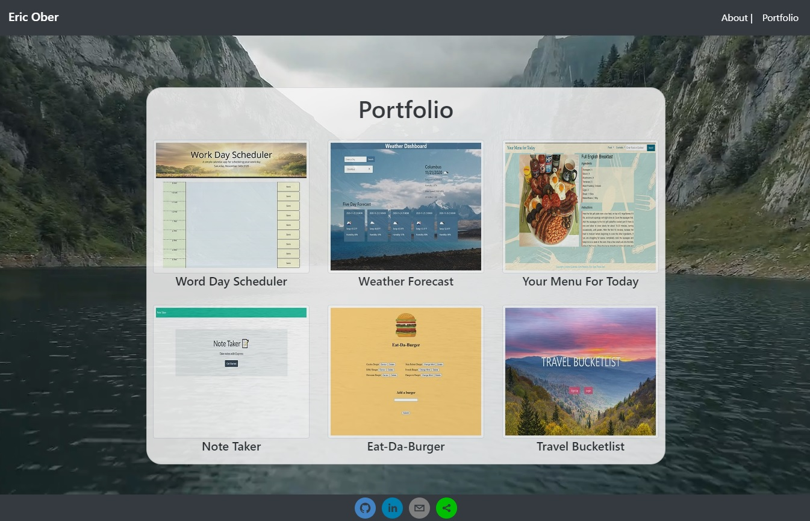

<h1 align="center"> React Portfolio </h1>

## Table of Contents
- [Description](#description)
- [Installation](#install)
- [Deployment](#deployed) 
- [Screenshot](#screenshot)
- [License](#license)
- [Questions](#questions)

## Description
Portfolio updated with React.

## Deployed Site
https://esober101.github.io/react-portfolio/

## Screenshot

## License

## Questions
Github: https://github.com/esober101

Email: ericscottober@gmail.com